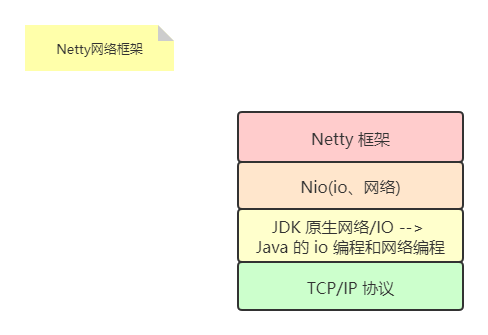

# 2020.12.31记录

## Netty介绍

1. Netty 是由 JBOSS 提供的一个开源的 Java 框架。
2. Netty 是一个 **异步的**、基于 **事件驱动**的网络应用框架，用以快速开发高性能、高可靠性的网络 IO 程序。

  注：

+ 事件驱动比如网页上有一个按钮，可以触发一个事件，比如点击事件，这个事件会驱动/调用一个函数。
+ 异步是相对于同步而言，同步相当于浏览器发送一个请求给服务器，必须等待响应，收到响应之后才能去做其他操作；而异步不一定要等到响应回来才去做其他操作，会指定一个回调函数来处理回复的响应。

3. Netty 主要针对在 TCP 协议下，面向 Client 端的高效并发应用，或者 Peer-to-Peer 场景下的大量数据持续传输的应用。其网络框架如下：

4. Netty 本质是一个 NIO 框架，适用于服务器通讯相关的多种应用场景。

## 应用场景

1. 分布式系统中，各个节点之间需要远程服务调用，高性能的 RPC 框架必不可少，Netty 作为基础的通信组件被这些 RPC 框架使用。
2. 阿里分布式服务框架、Dubbo 的 RPC 框架使用 Dubbo 协议进行节点间通信，而 Netty 作为基础的通信组件，实现各个节点之间的内部通信。